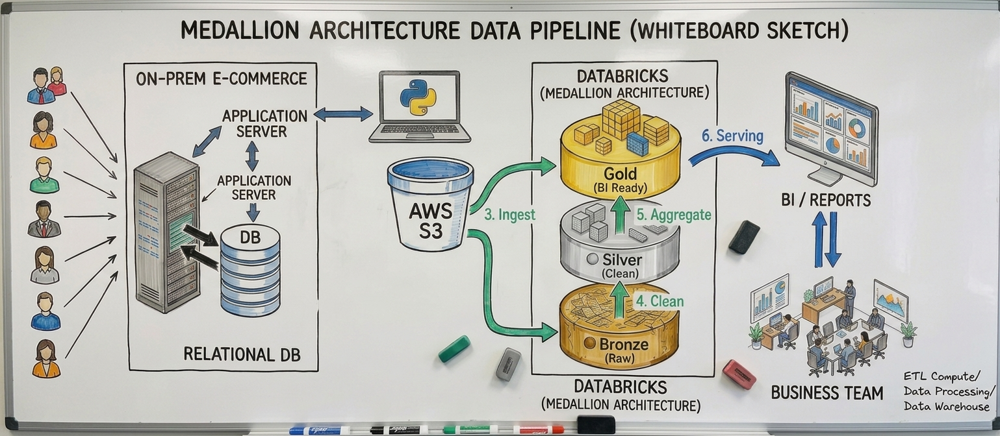
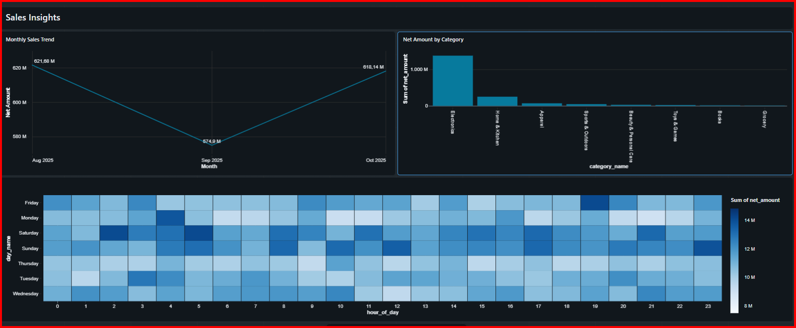

# 🛒 E-Commerce Data Lakehouse (Medallion Architecture)

Un pipeline de datos *end-to-end* implementado en **Databricks** utilizando **PySpark**, **Unity Catalog** y la **Arquitectura Medallón** (Bronze, Silver, Gold). 

## 🚀 Arquitectura del Proyecto

El flujo de datos está diseñado bajo los principios de **Delta Lake**, extrayendo datos desde una capa *Raw* hacia una estructura analítica escalable[cite: 12]. Todo el pipeline puede ser orquestado mediante **Databricks Workflows** directamente desde este repositorio.

1. **Capa Raw (Landing Zone):** Descarga automatizada de archivos estáticos `.csv` hacia los volúmenes de Databricks.
2. **Capa Bronze:** Ingesta de los datos crudos y conversión a tablas en formato **Delta** para garantizar inmutabilidad, propiedades ACID y control de versiones[cite: 12].
3. **Capa Silver:** Limpieza profunda de datos (tratamiento de nulos, estandarización de strings, formateo de fechas) y transformación estructural[cite: 12].
4. **Capa Gold:** Creación de tablas denormalizadas y agregaciones orientadas al negocio listas para ser consumidas por herramientas de inteligencia de negocios (BI)[cite: 12].

## 📊 Sales Insights Dashboard

Los datos procesados y enriquecidos en la capa Gold alimentan un dashboard que permite a los tomadores de decisiones analizar el rendimiento del e-commerce:

**Métricas clave analizadas:**
* **Monthly Sales Trend:** Evolución del monto neto de ventas a través de los meses, visualizando las fluctuaciones entre Agosto y Octubre de 2025[cite: 11].
* **Net Amount by Category:** Identificación de las categorías más rentables, demostrando que *Electronics* es el sector con mayores ingresos, seguido por *Home & Kitchen*[cite: 11].
* **Heatmap de Actividad:** Mapa de calor de horas y días de la semana, destacando visualmente los picos de volumen de ventas para optimizar campañas de marketing[cite: 11].

## 🛠️ Tecnologías y Herramientas
* **Lenguajes:** Python (PySpark), SQL
* **Ingeniería de Datos:** Databricks, Delta Lake
* **Gobernanza y Almacenamiento:** Unity Catalog, Databricks Volumes
* **Control de Versiones:** Git, GitHub

## ⚙️ Cómo ejecutar este proyecto
1. Clona este repositorio en tu entorno local o enlázalo a tu espacio de trabajo de Databricks.
2. Ejecuta el notebook de configuración inicial (`setup`) para crear el catálogo, los esquemas (`bronze`, `silver`, `gold`) y poblar automáticamente la capa *Raw*.
3. Ejecuta los cuadernos de transformación secuencialmente, o configúralos como un Job automatizado en **Databricks Workflows**.

---
**👨‍💻 Desarrollado por:** Jilme Cervantes Martínez  
* Data Engineer *
